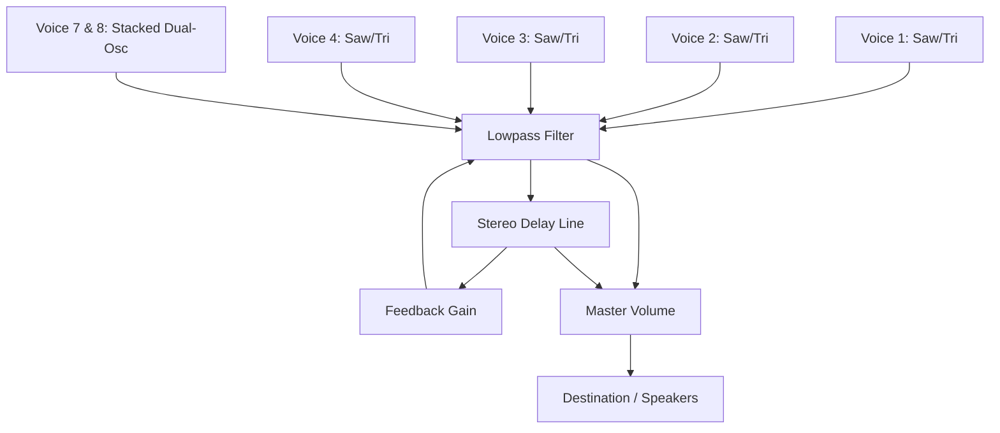

# Astro Drone

A premium, web-based ambient drone and microtonal performance synthesizer inspired by advanced desktop hardware instruments like the Elta Music Solar 42. Built entirely using the **Web Audio API** with modern vanilla HTML5, CSS3, and JavaScript.

---

## Key Features

### 🌌 Voices 1–4: Drone Matrix
*   **Four Independent Oscillators**: Dedicated voice toggles running custom waveforms (sawtooth and triangle blend) for rich, textured drone soundscapes.
*   **Analog Drift Engine**: Running a real-time background simulation thread that injects microtonal frequency deviations (vibrato drift) for authentic analog-style warmth and movement.
*   **Wide Pitch Controls**: Individual linear faders to sweep frequencies dynamically.

### 🎛️ Filter Processing & X/Y Pad
*   **Lowpass Filter Matrix**: Control cutoffs (80Hz to 6000Hz) and high-Q resonance feedback parameters simultaneously in real time.
*   **Interactive Screen Grid**: Dynamic mouse and touch-move coordinate mapping, complete with responsive crosshairs and glowing visual state cues.
*   **Time-domain FX**: Integrated feedback delay network with adjustable delay times to create expansive spatial depth.

### 🎹 Voices 7 & 8: Microtonal Performance Keyboard
*   **Dual-Stacked Voice Engine**: Layers a sawtooth oscillator and a triangle oscillator per key with adjustable sub-detuning offsets (in cents).
*   **Attack / Decay Envelope**: Custom transient shape control allowing for short percussive plucks or slow-blooming ambient swells.
*   **Gold-Plated PCB Touchplates**: 12 custom touchplates configured as an expressive microtonal keyboard. Traces illuminate with active cyan neon lighting states on click or touch.
*   **Quantization Scale Selector**:
    *   *Just Intonation*: Pure harmonic proportions based on natural frequency ratios.
    *   *Pelog*: Microtonal scale approximation inspired by traditional Indonesian Gamelan metal instruments.
    *   *Chromatic*: Western 12-Tone Equal Temperament.
*   **Generative Looping**: An automated looping step engine that randomly triggers adjacent microtonal scale divisions based on your envelope times for hands-free generative music composition.

---

## File Structure

```text
├── index.html        # Semantic HTML5 layout and metadata structure
├── styles.css        # Premium dark-mode theme, glassmorphic layout, and custom hardware UI
├── app.js            # Web Audio API routing graph, scales logic, and event handlers
└── README.md         # Project documentation
```

---

## Audio Signal Routing Architecture



---

## Getting Started

No build tools, compilation, or server configurations are required.

1. Clone or download the repository to your local machine.
2. Open the [index.html](file:///Users/timede/Documents/Drone-Synth/index.html) file directly in any modern web browser (Google Chrome, Safari, Firefox, or Edge).
3. Click the pulsing **INITIALIZE ASTRO AUDIO GRAPH** button in the header to activate the browser's audio context.
4. Turn on the drone matrix voices, sweep the X/Y pad, select a scale, and start playing the performance touchplates!
